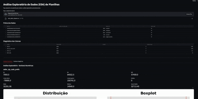

# EDA Automática com Python e Streamlit

---

# Preview da Aplicação

  

---

## Sobre o Projeto

Este projeto implementa uma Análise Exploratória de Dados (EDA) automática, permitindo que o usuário faça upload de planilhas (CSV ou Excel) e receba instantaneamente um diagnóstico completo dos dados, sem precisar escrever código adicional.

---

## Funcionalidades

### 🔍 Upload e Prévia dos Dados
- Upload de arquivos `.csv` e `.xlsx`  
- Visualização inicial da tabela  

### Diagnóstico Automático das Colunas
- Identificação do tipo de dado  
- Percentual de valores nulos  
- Quantidade de valores únicos  

### Análise Exploratória – Variáveis Numéricas
- Média, mediana e desvio padrão  
- Quartis (Q1, Q3) e IQR  
- Detecção automática de outliers  
- Histogramas  
- Boxplots com limites de outliers destacados  

### Análise Exploratória – Variáveis Categóricas
- Quantidade de categorias únicas  
- Distribuição de frequência  
- Visualização automática:
- Até 5 categorias: todas exibidas  
- Mais de 5 categorias: Top 5 + "Outros"  

---

## 🛠️ Stack Tecnológica

- Python
- Pandas
- NumPy
- Matplotlib
- Streamlit

Aplicação em Streamlit
[STREAMLIT](https://edaautomatica.streamlit.app/)
---
